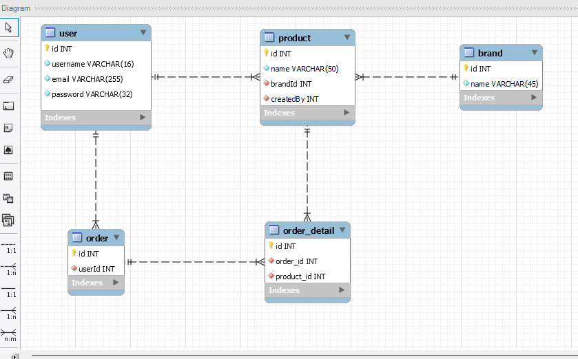

# MySQL - Database Diagram Scripts

## Description

Basic database modeling with MySql Diagrams and sql scripts

## Tables

### user

- id Int (pk)
- username varchar(16)
- email varchar(255)
- password varchar(32)

### product

- id Int (pk)
- name varchar(50)
- brandId Int (fk)
- createdBy Int (fk)

### brand

- id Int (pk)
- name varchar(45)

### order

- id Int (pk)
- userId Int (fk)

### order_detail

- id Int (pk)
- order_id (fk)
- product_id (fk)

## Relations

### user 1 <--> n product

### brand 1 <--> n product

### order n <--> n product

## Diagram

